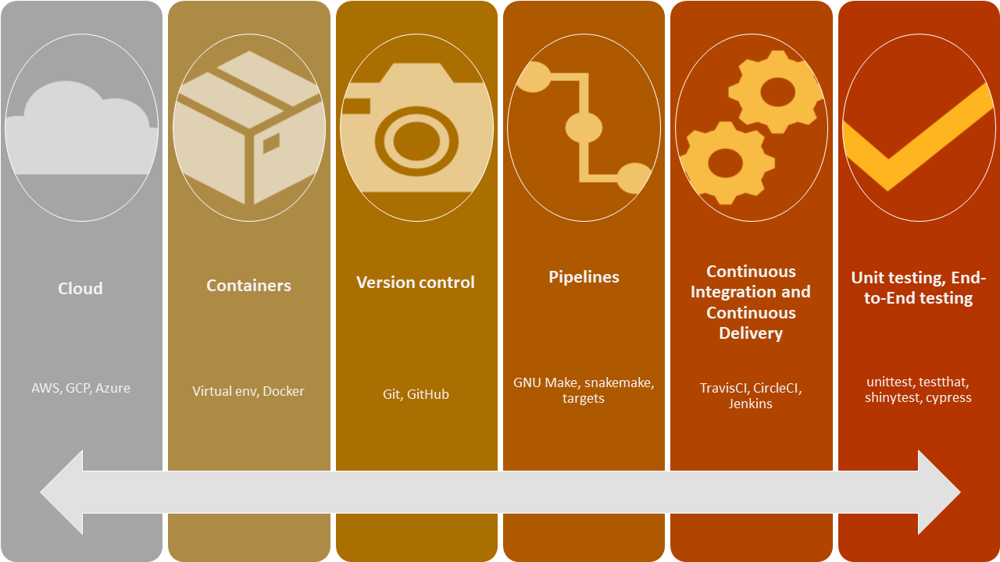

# Primer {#primer}

## Overview

Software development principles such as containerization, version control, and automation are highly useful components of reproducible data analysis workflows (Figure 1). 

```{r, out.width="100%"}

```

